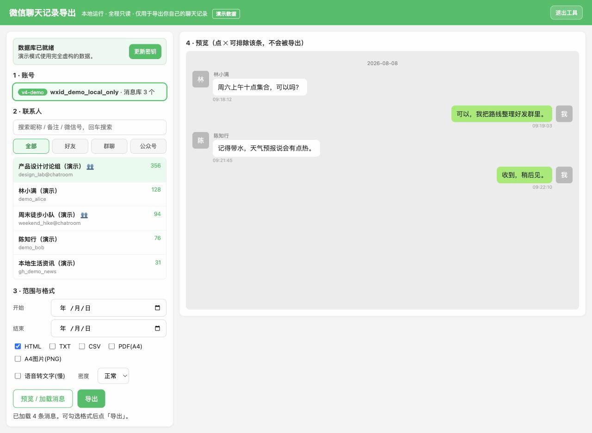

# 微信聊天记录导出工具

在本机选择好友或群聊，按日期预览并导出本人 macOS 微信聊天记录。应用只监听
`127.0.0.1`，读取微信数据库时使用只读连接，所有解密、媒体解析和导出均在本机完成。

> **重要声明：** 本项目是与腾讯、微信无关的非官方开源工具，仅限处理你本人拥有或已获
> 明确授权访问的本机数据。使用前请自行确认当地法律、组织政策和相关服务条款；由安装、
> 密钥提取、数据解密、导出、保管或传播产生的风险与责任由使用者承担。详见
> [完整免责声明](DISCLAIMER.md)。

> 当前稳定目标：Apple Silicon Mac、macOS 13+、微信 4.x。Intel Mac 与微信 3.x
> 保留代码兼容性，但发布包尚未完成实机验证。Windows 版本正在规划中，当前 macOS
> 发布包不能用于 Windows。



> 截图隐私说明：上图中的账号、昵称、微信号、群名、消息、时间及数量均为程序生成的
> **虚构演示数据**，不取自任何真实微信账号或聊天记录，也不是对真实截图进行模糊处理。

## 功能

- 按好友、群聊、公众号筛选，并通过昵称、备注、微信号搜索
- 预览聊天记录，按开始/结束日期筛选，逐条排除不需要的消息
- 导出 HTML、TXT、CSV、PDF 和 A4 PNG
- 尽可能保留聊天名称、备注、昵称、微信号、内部标识和实际发送者信息
- 为消息分配稳定顺序号；A4 PNG 与 PDF 标注“第 X 页 / 共 Y 页”
- 自动生成归档说明和 JSON 校验清单，记录消息链及每个导出文件的 SHA-256
- 解析文本、图片、语音、视频、转账、红包、引用、位置、链接卡片等常见消息
- HTML 可内嵌媒体为单文件；语音转文字可通过源码版的可选依赖启用
- 多账号与微信 4.1+ 每数据库独立密钥支持

## 下载与启动

从 GitHub Releases 下载 `WeChatExporter-macOS-arm64.zip`，解压后打开
`微信聊天记录导出.app`。

由于社区构建目前没有 Apple Developer ID 公证，macOS 第一次可能阻止启动。请在 Finder
中右键应用选择“打开”，再确认一次。不要从来历不明的镜像下载本工具。

首次启动后：

1. 给应用开启“完全磁盘访问权限”，然后重新启动应用。
2. 点击页面顶部“首次设置”。工具会退出当前微信，复制一份微信到
   `~/Library/Application Support/WeChatExporter/WeChat-Readable.app`。
3. 工具只对该副本做临时签名，并通过 macOS 自带 LLDB 捕获当前账号的数据库密钥；
   `/Applications/WeChat.app` 原件不会被修改，也不需要关闭 SIP。
4. 微信副本打开后保持登录。设置成功时，页面会自动刷新好友和群聊列表。
5. 选择聊天、日期和格式，加载预览后导出。文件默认写入桌面。

首次设置依赖 Xcode Command Line Tools。如果系统没有安装，请先运行：

```bash
xcode-select --install
```

微信升级或切换账号后，如果旧密钥失效，点击“更新密钥”重新执行即可。

## 隐私与本机文件

本工具不含遥测、账号登录接口或云端服务。运行时会在本机创建：

| 路径 | 内容 | 敏感性 |
|---|---|---|
| `~/.wechat_exporter/keys.json` | 每个数据库的本机解密密钥 | 高 |
| `~/.wechat_exporter/decrypted/` | 只读源数据库的明文副本 | 高 |
| `~/.wechat_exporter/voice_cache/` | 可选语音转写缓存 | 高 |
| `~/Library/Application Support/WeChatExporter/` | 临时签名的微信副本 | 中 |

这些路径均在 Git 仓库之外，不会自动上传。导出完成后如不再使用，可以关闭应用并删除
上述目录；删除后下次使用需要重新完成首次设置。导出的聊天内容可能包含第三方个人信息，
请仅在有权处理的范围内保存和分享。

## 从源码运行

建议 Python 3.11 或 3.12：

```bash
git clone https://github.com/liangyeshier/wechat-exporter.git
cd wechat-exporter
python3.12 -m venv .venv
.venv/bin/pip install -r requirements-app.txt
.venv/bin/python app.py
```

需要离线语音转文字时，改装 `requirements-voice.txt`。Whisper 模型会在首次使用时单独
下载，因此标准 `.app` 不捆绑该功能的模型运行时。

命令行入口：

```bash
.venv/bin/python main.py --help
.venv/bin/python main.py --contact "联系人名称" --format html --yes
```

## 构建 macOS 应用

```bash
PYTHON_BIN=python3.12 ./scripts/build_macos_app.sh
./scripts/package_macos_release.sh
```

产物位于 `dist/微信聊天记录导出.app` 和
`dist/WeChatExporter-macOS-arm64.zip`。当前脚本执行临时签名，适合本机测试和社区分发；
正式 Developer ID 签名、公证与自动更新仍在后续路线图中。

GitHub Actions 自动构建尚未启用；当前 Release 来自上述本机构建脚本，并附带 SHA-256
校验文件。启用自动构建前仍需在维护账号上授予工作流写入权限并完成一次独立验证。

## 验证

```bash
python tests/test_pipeline.py
python tests/test_export_archive.py
python -m py_compile app.py main.py core/*.py export/*.py
codesign --verify --deep --strict --verbose=2 "dist/微信聊天记录导出.app"
```

合成数据库测试不包含任何真实微信数据。发布前还应在授权的本人账号上完成联系人加载、
消息预览和至少一种导出格式的端到端测试。

## 归档与辅助核验

每次成功导出还会生成：

- `*_归档说明.txt`：会话和导出账号信息、时间范围、消息数量、归档编号及文件校验值
- `*_归档校验.json`：机器可读的身份字段、逐条消息顺序、SHA-256 消息链和文件清单

HTML、TXT、CSV、A4 PNG 和 PDF 使用同一套从 1 开始的消息顺序。A4 PNG 文件名包含
`第NN页_共NN页`，图片页脚和 PDF 页脚同时显示“第 X 页 / 共 Y 页”。导出后可以运行
`shasum -a 256 <文件名>`，并与归档说明中的值比较；不一致表示该文件在生成清单后发生了
变化。

这些信息可以辅助说明导出对象、范围、顺序和导出后文件是否发生变化，但它们不是电子
签名、可信时间戳、公证或司法鉴定，也不能单独证明源设备、账号归属和聊天内容必然真实。
用于投诉、仲裁、诉讼或其他正式程序时，请同时保留原设备、原始数据库、完整导出目录、
获取过程记录，并根据接收机构或专业人士的要求处理。

## 已知限制

- 微信并未提供官方聊天数据库导出 API，目录、结构或加密实现更新后可能需要适配。
- 媒体定位为尽力而为，已清理、未下载或新格式附件可能无法恢复。
- 标准 `.app` 支持语音播放，但不捆绑体积较大的语音转文字引擎。
- 未做 Developer ID 公证，因此初次启动需要 Finder 右键“打开”。
- Windows `.exe` 尚未发布。跨平台工作会复用解析与导出层，并单独实现 Windows 数据
  定位、密钥获取、凭据保护和打包流程。

## 安全与合法使用

本项目仅用于备份你本人合法访问的本机微信数据，与腾讯或微信无关，也未获得其授权或
背书。密钥提取和数据库解密可能受当地法律、组织政策及微信服务条款约束，使用者需自行
确认权限和合规性。请勿绕过他人设备、账号或访问控制，也不要未经同意传播聊天内容。

安全问题请按 [SECURITY.md](SECURITY.md) 私下报告，不要在公开 Issue 中粘贴密钥、数据库、
日志中的 wxid 或聊天截图。

使用、贡献或分发本项目即表示你已阅读并理解 [DISCLAIMER.md](DISCLAIMER.md)。该声明不
替代针对你所在司法辖区的专业法律意见。

## 许可证

[MIT](LICENSE)。项目包含原始作者与后续贡献者的工作；保留 Git 历史与许可证声明。
